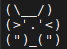
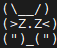
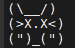
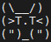

   

# Serial Port Tamagotchi
This is a Tamagotchi that lives in the ASIC world. Made for a TinyTapeout4 

# How to use
To use this project, you need to connect a serial port to in[0] and out[0] of the chip. Then, open a serial terminal.

## objetive
As a normal Tamagotchi game, the objetive is to keep your pet alive. You can do this by feeding it, playing with it, and cleaning it's poop. If you don't do this, your pet will die.

## controls
In this table you can see the controls of the game:
| Key | Action |
| --- | --- |
| `e` | Feed your pet |
| `p` | Play with your pet |
| `b` | Clean your pet's poop |
| `t` | Talk with your Tamagotchi |
| `s` | Sleep |
| `w` | Wake up |

## states
The Tamagotchi has 2 states:
- Awake: In this state, you can play with your pet, feed it, clean it's poop, and talk with it.
- Sleep: In this state, you can't do anything with your pet. It will sleep until you awake them `w`, and then it will wake up.

## needs
The Tamagotchi has 5 needs:
- Hunger: If your pet is hungry, you need to feed it `e`.
- Happiness: If your pet is sad, you need to play with it `p`.
- Hygiene: If your pet is dirty, you need to clean it's poop `b`.
- Energy: If your pet is tired, you need to let it sleep `s`.
- Social: If your pet is lonely, you need to talk with it `t`.

## death
If you don't take care of your pet, it will die. To revive it, you need to reset the game.

# Animations
For every state the Tamagotchi has an animation. Here you can see them:
| State | Animation |
| --- | --- |
| Awake/normal | |
| Sleep |  |
| Dead |  |
| Hungry |  1](images/41da8ccd67a5408e97dc32218f401963bc25e5097a26b31d44dcad26a90605c9.png)|
| Sad |   |
| Dirty |  |
| Tired |  |
| Lonely |  |

  
