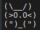
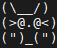
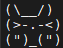

   

# Serial Port Tamagotchi

Welcome to the world of ASIC Tamagotchi! This Tamagotchi is designed for the TinyTapeout4.

## How to Use

To interact with this project, you'll need to connect a serial port to `in[0]` and `out[0]` of the chip. Then, open a serial terminal.

## Objective

Just like a traditional Tamagotchi game, your objective is to keep your pet alive and happy. You can achieve this by feeding it, playing with it, and cleaning up after it. Neglecting these responsibilities will result in your pet's demise.

## Controls

Here are the controls for the game:

| Key | Action |
| --- | --- |
| `e` | Feed your pet |
| `p` | Play with your pet |
| `b` | Clean up your pet's poop |
| `t` | Talk to your Tamagotchi |
| `s` | Put your Tamagotchi to sleep |
| `w` | Wake up your Tamagotchi |

## States

Your Tamagotchi can be in one of two states:

- **Awake**: In this state, you can interact with your pet, including feeding, playing, cleaning, and talking to it.
- **Sleep**: During this state, your pet is resting, and you can't interact with it. To wake it up, press `w`.

## Needs

Your Tamagotchi has five basic needs:

1. **Hunger**: Feed your pet (`e`) when it's hungry.
2. **Happiness**: Play with your pet (`p`) to keep it happy.
3. **Hygiene**: Clean up your pet's poop (`b`) to maintain cleanliness.
4. **Energy**: Let your pet sleep (`s`) when it's tired.
5. **Social**: Talk to your Tamagotchi (`t`) to alleviate loneliness.

## Death

Failure to address your pet's needs will result in its death. You can revive it by resetting the game.

# Animations

Each Tamagotchi state has a corresponding animation:

| State          | Animation                                                  |
| -------------- | ---------------------------------------------------------- |
| Awake/Normal   |  |
| Sleep          |  |
| Dead           |  |
| Hungry         |  |
| Sad            |  |
| Dirty          |  |
| Tired          |  |
| Lonely         |  |
